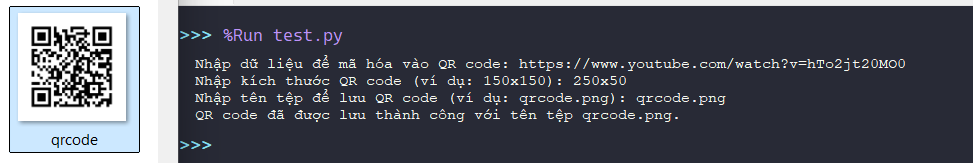
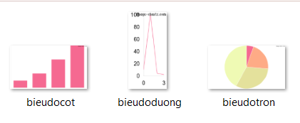

# Image Charts Creator - @T7C

use APIs public of [Image-Charts](https://image-charts.com) free call.

## Mục lục
1. [QRcode Generator](#qr-code-generator)
2. [Biểu đồ](#bieu-do)


## Cách sử dụng
```bash
pip install requests
```
## Qr code generator
1. sử dụng mã này để tạo qrcode:
```python
import requests
def create_qr_code(data, size='150x150', filename='qrcode.png'):
    if not data.strip():
        print("Dữ liệu không thể trống.")
        return
    
    url = f'https://image-charts.com/chart?chs={size}&cht=qr&chl={data}'
    
    try:
        response = requests.get(url)
        response.raise_for_status()
        with open(filename, 'wb') as file:
            file.write(response.content)
        print(f"QR code đã được lưu thành công với tên tệp {filename}.")
    except requests.RequestException as e:
        print(f"Lỗi khi tạo QR code: {e}")

def main():
    data = input("Nhập dữ liệu để mã hóa vào QR code: ")
    size = input("Nhập kích thước QR code (ví dụ: 150x150): ")
    filename = input("Nhập tên tệp để lưu QR code (ví dụ: qrcode.png): ")
    
    create_qr_code(data, size, filename)

if __name__ == "__main__":
    main()
```
2. 


## Biểu đồ
1.
```python
import requests

def create_chart(data, chart_type='bvs', size='700x400', filename='chart.png'):
    if not data:
        print("Dữ liệu không thể trống.")
        return
    

    data_str = ','.join(map(str, data))
    
   
    url = f'https://image-charts.com/chart?chs={size}&cht={chart_type}&chd=t:{data_str}&chco=FF0000'
    
    try:
        response = requests.get(url)
        response.raise_for_status()
     
        with open(filename, 'wb') as file:
            file.write(response.content)
        print(f"Biểu đồ đã được lưu thành công với tên tệp {filename}.")
    except requests.RequestException as e:
        print(f"Lỗi khi tạo biểu đồ: {e}")

def main_chart():
    print("Chọn loại biểu đồ:")
    print("1. Biểu đồ cột")
    print("2. Biểu đồ đường")
    print("3. Biểu đồ tròn")

    choice = input("Nhập số lựa chọn: ")

    chart_types = {
        '1': 'bvs',  
        '2': 'lc',   
        '3': 'p',   
    }

    chart_type = chart_types.get(choice, 'bvs')

    data = input("Nhập dữ liệu cho biểu đồ (dữ liệu số, ví dụ: 10,20,30,40): ")
    data = [int(x) for x in data.split(',')]
    
    size = input("Nhập kích thước biểu đồ (ví dụ: 700x400): ")
    filename = input("Nhập tên tệp để lưu biểu đồ (ví dụ: chart.png): ")

    create_chart(data, chart_type, size, filename)

if __name__ == "__main__":
    main_chart()
```
2. 


## Tham khảo
1. vẫn còn rất nhiều chart khác

[Document](https://documentation.image-charts.com/)